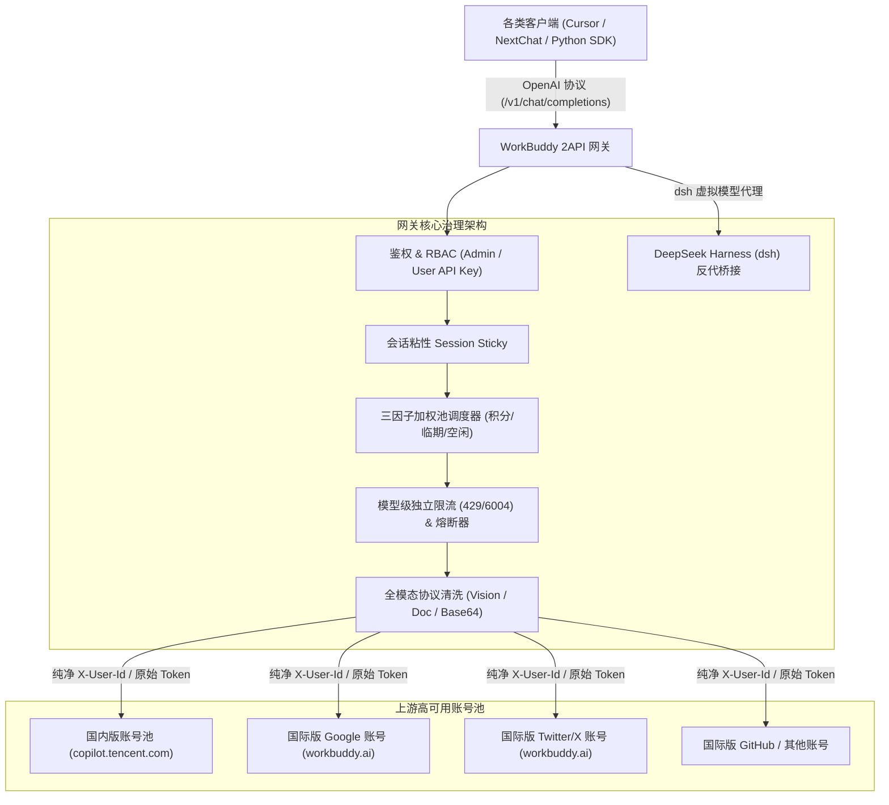
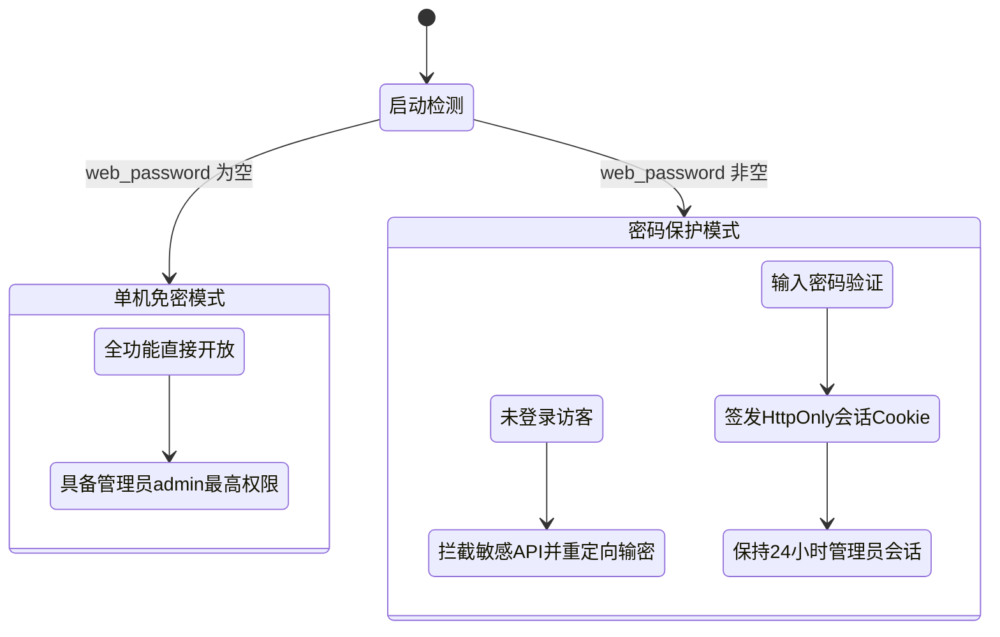
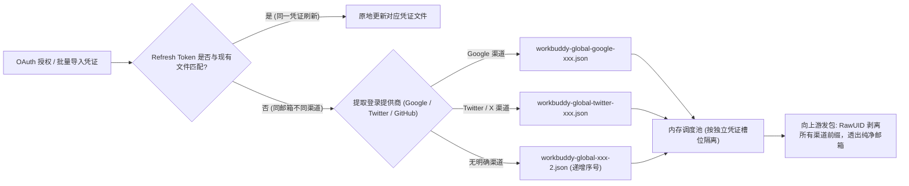
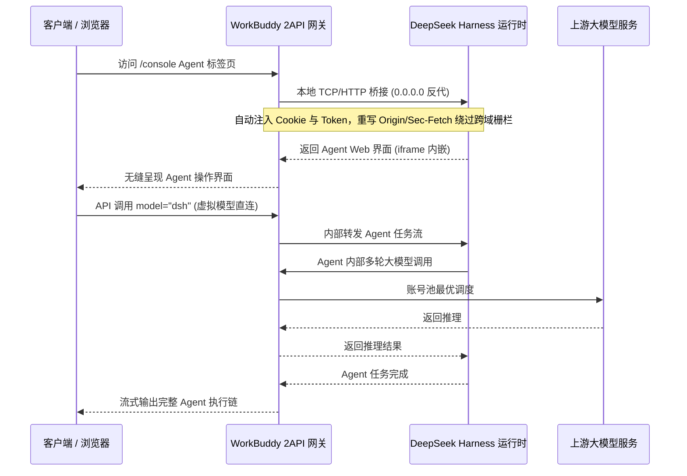

# WorkBuddy 2API · 全功能官方用户与开发架构手册 (v1.2.17)

<p align="center">
  <b>一键将 WorkBuddy / CodeBuddy 账号转化为标准 OpenAI 兼容接口的高性能本地/跨平台网关</b><br>
  双域容灾调度 · 多渠道同邮箱智能共存 · 赛博前台门户 · 原生桌面窗口 · 账号池多维轮询 · 熔断冷却自愈 · 视觉全模态 · DeepSeek Harness 智能体内嵌
</p>

<p align="center">
  
  
  
  
  
  
</p>

---

## 目录 (Table of Contents)

- [1. 项目简介与核心定位](#1-项目简介与核心定位)
- [2. 核心特性全览 (v1.2.17)](#2-核心特性全览-v1217)
- [3. 快速安装与多环境部署](#3-快速安装与多环境部署)
  - [3.1 方式一：Windows 原生桌面客户端（双击即用）](#31-方式一windows-原生桌面客户端双击即用)
  - [3.2 方式二：Docker / Docker Compose 一键部署（推荐服务器/NAS）](#32-方式二docker--docker-compose-一键部署推荐服务器nas)
  - [3.3 方式三：源码构建与跨平台编译（Windows / Linux / macOS）](#33-方式三源码构建与跨平台编译windows--linux--macos)
  - [3.4 应用内一键检查更新与自动升级](#34-应用内一键检查更新与自动升级)
- [4. 前台赛博门户与后台控制台](#4-前台赛博门户与后台控制台)
  - [4.1 前台赛博门户 (`/`)](#41-前台赛博门户-)
  - [4.2 运维控制中枢 (`/console` 或 `/dashboard`)](#42-运维控制中枢-console-或-dashboard)
  - [4.3 控制台全功能操作指南](#43-控制台全功能操作指南)
- [5. 安全防御体系与 Web 管理密码](#5-安全防御体系与-web-管理密码)
  - [5.1 单机免密模式 vs 密码验证模式](#51-单机免密模式-vs-密码验证模式)
  - [5.2 密码管理与合规校验逻辑](#52-密码管理与合规校验逻辑)
  - [5.3 前端防暴力探测与网络安全加固](#53-前端防暴力探测与网络安全加固)
- [6. 双域融合调度与同邮箱多渠道隔离机制](#6-双域融合调度与同邮箱多渠道隔离机制)
  - [6.1 国内版 (CN) 与国际版 (Global) 双域容灾](#61-国内版-cn-与国际版-global-双域容灾)
  - [6.2 国际版 Google 与 Twitter/X 同邮箱并存隔离机制 (v1.2.17 突破)](#62-国际版-google-与-twitterx-同邮箱并存隔离机制-v1217-突破)
  - [6.3 磁盘凭证文件智能命名算法](#63-磁盘凭证文件智能命名算法)
- [7. 多租户隔离与 RBAC 权限系统](#7-多租户隔离与-rbac-权限系统)
  - [7.1 用户角色（Admin 与 User）](#71-用户角色admin-与-user)
  - [7.2 专属 API Key 隔离与账号池调度保障](#72-专属-api-key-隔离与账号池调度保障)
  - [7.3 内存优先与磁盘故障自愈体系](#73-内存优先与磁盘故障自愈体系)
- [8. DeepSeek Harness (dsh) AI Agent 智能体集成](#8-deepseek-harness-dsh-ai-agent-智能体集成)
  - [8.1 免环境一键安装绿色运行时](#81-免环境一键安装绿色运行时)
  - [8.2 浏览器安全栅栏穿透与反向代理](#82-浏览器安全栅栏穿透与反向代理)
  - [8.3 虚拟模型代理 direct-call (`dsh`)](#83-虚拟模型代理-direct-call-dsh)
- [9. 全模态视觉推理与模型体系](#9-全模态视觉推理与模型体系)
  - [9.1 视觉推理与文档分析能力](#91-视觉推理与文档分析能力)
  - [9.2 模型目录与计费倍率透视](#92-模型目录与计费倍率透视)
  - [9.3 内置演练场 (Playground)](#93-内置演练场-playground)
- [10. 客户端接入实战指南](#10-客户端接入实战指南)
  - [10.1 cURL 与通用 HTTP 规范](#101-curl-与通用-http-规范)
  - [10.2 Python (OpenAI SDK)](#102-python-openai-sdk)
  - [10.3 Node.js / TypeScript (OpenAI SDK)](#103-nodejs--typescript-openai-sdk)
  - [10.4 主流客户端配置 (NextChat / Cherry Studio / Cursor / Cline)](#104-主流客户端配置-nextchat--cherry-studio--cursor--cline)
- [11. 配置全集参考 (`config.json`)](#11-配置全集参考-configjson)
- [12. 架构设计与底层机制原理解析](#12-架构设计与底层机制原理解析)
  - [12.1 调度池三因子加权随机算法](#121-调度池三因子加权随机算法)
  - [12.2 模型级独立软限流与熔断退避](#122-模型级独立软限流与熔断退避)
  - [12.3 会话粘性机制 (Session Sticky)](#123-会话粘性机制-session-sticky)
- [13. 常见问题排查与运维指南 (FAQ)](#13-常见问题排查与运维指南-faq)
- [14. 开源协议与致谢](#14-开源协议与致谢)

---

## 1. 项目简介与核心定位

`workbuddy2api` 是一款针对腾讯云 CodeBuddy（国内版）以及 WorkBuddy（国际版）生态深度定制的高性能、生产级 AI 接口网关。

它通过逆向协议与轻量级代理技术，将用户持有的多个 CodeBuddy / WorkBuddy 账号汇聚成高可用账号调度池，对外提供 **100% 兼容 OpenAI 标准** 的 RESTful API（如 `/v1/chat/completions`、`/v1/models`）。

无论您是个人开发者希望在日常编辑器（如 Cursor、VS Code Cline）中使用 DeepSeek、Claude、GPT-4o，还是团队希望在统一的中继平台（如 OneAPI / NewAPI）上聚合大模型资源，`workbuddy2api` 均可提供开箱即用、无缝接管的极佳体验。

---

## 2. 核心特性全览 (v1.2.17)



1. **单文件原生桌面窗口**：
   - 彻底摆脱多可执行文件碎片与批处理黑框，Windows 端基于原生 Edge WebView2 驱动，打包为单文件 `workbuddy2api.exe`（~9.5MB），双击直接呈现 1280x820 桌面交互窗口。
2. **全新赛博炫酷前台门户与后台控制中枢分离**：
   - 首页根路径 `/` 渲染全新设计的赛博朋克极客门户，实时展示网关脱敏健康指标、双域可达性与模型清单，优雅对外展示；
   - 运维控制台收拢于 `/console` 与 `/dashboard`，配齐完备的流量监控、会话分析与账号管理功能。
3. **安全防御体系与 Web 密码认证**：
   - 支持单机免密模式与密码保护模式一键切换；
   - 5 分钟 5 次错误密码暴力探测自动封锁 IP，全站注入安全响应头（`nosniff`、`SAMEORIGIN`、`strict-origin-when-cross-origin` 等）。
4. **同邮箱跨渠道多账号共存机制（v1.2.17 特性）**：
   - 彻底解决国际版中 Google 登录与 Twitter/X 登录绑定同一邮箱导致的文件与内存池相互覆盖问题；
   - 文件命名按登录渠道自动分流，内存池分配独立并发与积分槽位，向上游发起请求时自动还原纯净 `X-User-Id` 邮箱。
5. **多租户隔离与 RBAC 权限体系**：
   - 支持管理员（Admin）与普通用户（User）多级角色；
   - 支持为每个用户签发独立 API Key 与独立限额；
   - 内存优先（Memory-First）与磁盘权限自愈，杜绝容器环境文件写入错误导致的请求中断。
6. **全模态与文档解析**：
   - 完美支持 OpenAI 标准视觉协议（`image_url`）与 Claude 专用 Base64 协议（`type: image`）；
   - 支持直接向大模型传递 `.txt` / `.md` / `.pdf` / `.py` 等代码与文本文件，网关自动提取清洗为规范上下文；
   - 内置演练场（Playground）支持一键拖拽附件与剪贴板截图粘贴（`Ctrl+V`）。
7. **DeepSeek Harness (dsh) AI Agent 深度内嵌**：
   - 零依赖全自动安装便携式绿色 Node.js 运行时；
   - 自动反向代理穿透桥接，自动注入 Cookie 与鉴权 Token，攻破浏览器跨域与信任栅栏；
   - 注册虚拟 `dsh` 大模型，任何兼容客户端均可将 Agent 当作普通大模型直接调用。
8. **跨平台一键自动升级**：
   - 支持 Windows、Linux、macOS 全平台原生二进制，集成应用内一键版本检测与在线平滑热更新。

---

## 3. 快速安装与多环境部署

### 3.1 方式一：Windows 原生桌面客户端（双击即用）

适用于个人开发者在本地 Windows 环境日常使用：

1. 前往 GitHub [Releases 页面](https://github.com/XCool-603/wrokbuddy2api/releases) 下载最新版的 `workbuddy2api.exe`。
2. 将程序放入一个专属目录（例如 `D:\Tools\workbuddy2api\`）。
3. **直接双击运行 `workbuddy2api.exe`**：
   - 客户端将自动唤起桌面管理窗口；
   - 首次启动会自动创建 `config.json`、`auths/` 与 `data/` 目录；
   - 点击界面顶部的 **「一键登录」** 按钮，系统会调起浏览器完成授权，刷新即可看到账号就绪。
4. 在您喜爱的第三方客户端中填入配置：
   - **API Base URL**: `http://127.0.0.1:7863/v1`
   - **API Key**: 留空（默认）或输入您设置的系统 Key。

---

### 3.2 方式二：Docker / Docker Compose 一键部署（推荐服务器/NAS）

适用于 VPS、私有云服务器、群晖 NAS 或 Linux 生产环境：

```bash
# 1. 克隆代码仓库
git clone https://github.com/XCool-603/wrokbuddy2api.git
cd wrokbuddy2api

# 2. 复制默认配置
cp config.example.json config.json

# 3. 启动容器集群
docker compose up -d --build
```

#### 容器更新与升级（保留所有配置与账号）
```bash
git pull origin main
docker compose up -d --build
```

#### 容器卷持久化与自动权限自愈说明
- 挂载路径：
  - `./auths:/app/auths`：账号授权 JSON 凭证存储；
  - `./data:/app/data`：状态快照、多用户数据库、缓存与设置；
  - `./config.json:/app/config.json:ro`：只读核心配置文件。
- **自动权限自愈**：容器内置 `docker-entrypoint.sh`，在初始化时自动检测并递归赋予 `/app/auths` 与 `/app/data` 全权访问（`umask 000` / `chmod -R 777`），彻底解决宿主机 UID/GID 与容器进程不一致引发的 `permission denied` 错误。

---

### 3.3 方式三：源码构建与跨平台编译（Windows / Linux / macOS）

本项目基于标准 Go 1.24+ 构建：

```bash
# 克隆仓库
git clone https://github.com/XCool-603/wrokbuddy2api.git
cd wrokbuddy2api

# 1. 编译 Windows 原生无控制台桌面 GUI 版本
go build -trimpath -ldflags "-H windowsgui -s -w" -o workbuddy2api.exe ./cmd/server

# 2. 编译 Linux 无头服务器版本 (Headless Server)
CGO_ENABLED=0 GOOS=linux GOARCH=amd64 go build -trimpath -ldflags "-s -w" -o workbuddy2api-linux-amd64 ./cmd/server

# 3. 编译 macOS 原生版本 (Apple Silicon)
CGO_ENABLED=0 GOOS=darwin GOARCH=arm64 go build -trimpath -ldflags "-s -w" -o workbuddy2api-darwin-arm64 ./cmd/server
```

---

### 3.4 应用内一键检查更新与自动升级

网关内置自动更新引擎：
- 控制台顶部常驻 **「检查更新」** 按钮；
- 后台通过 GitHub Releases API 检索最新发行版，当检测到新版本时，自动弹出更新日志与一键下载/替换升级选项，无需手动下载替换二进制。

---

## 4. 前台赛博门户与后台控制台

### 4.1 前台赛博门户 (`/`)

访问 `http://127.0.0.1:7863/` 会呈现经过全新美学设计的赛博朋克极客门户：
- **极客视觉体验**：采用深色渐变网格背景与琉璃毛玻璃面板（Glassmorphism），科技感拉满；
- **公开指标透视**：通过安全脱敏端点 `/ui/public/status` 实时显示服务在线状态、当前版本、就绪账号容量数、可用模型总数，以及国内版 (CN) 与国际版 (Global) 的双轨可达性；
- **一键复制代码示例**：提供 cURL、Python、Node.js 及 NextChat/Cherry Studio 等主流客户端的一键拷贝配置代码；
- **GitHub 开源直通车**：页面显著位置提供 GitHub 仓库直达与 Release 追溯；
- **管理中枢导航按钮**：右上角提供直通 `/console` 控制台的快速入口。

### 4.2 运维控制中枢 (`/console` 或 `/dashboard`)

控制台是网关的核心运维后台，提供多维度管理能力：

| 功能模块 | 说明 |
| :--- | :--- |
| **实时指标大盘** | 监控在途并发请求数、24小时/14天请求吞吐、分模型调用占比、平均响应耗时、缓存命中率 |
| **账号池列表** | 呈现所有账号的头像、昵称、UID、所属域（CN/Global）、登录渠道徽标（Google/Twitter/GitHub）、剩余积分、过期时间与实时状态 |
| **OAuth 授权登录** | 支持在控制台内一键唤起官方扫码或网页登录，自动拦截回调并持久化凭证 |
| **全格式批量导入** | 支持 `.json`、`.txt`、`.zip` 备份包、卡密、宽松非标准 JSON 的无痛解析与并发校验 |
| **一键备份导出** | 一键将所有账号凭证打包导出为 `.zip` 归档包，跨机迁移与灾备秒级完成 |
| **日常定时运维** | 一键批量签到、一键领取国际版试用加速包 |
| **冷却透明与一键解除**| 实时透出当前被限流账号的倒计时（如 `限流冷却中 (42s)`），提供 **「解除冷却」** 按钮秒级重回调度池 |
| **多用户租户管理** | 管理员开通租户账号、分配角色、重置租户 API Key、修改密码 |
| **在线演练场 (Playground)** | 调试流式对话、视觉图片上传、多格式文档附件解析、实时测速与 Token 消耗监控 |
| **DeepSeek Harness (dsh)** | 启动/停止 Agent 进程，iframe 无缝内嵌智能体网页 UI，直连控制台 |

---

## 5. 安全防御体系与 Web 管理密码

为防止服务部署在公网或局域网时控制台被未授权篡改，系统配备了完整的安全防御机制。

### 5.1 单机免密模式 vs 密码验证模式



1. **单机免密模式（默认开箱即用）**：
   - 当 `config.json` 中的 `web_password` 为空时，网关运行于本地单机免密模式；
   - 访问 `/console` 无需输密，操作直接以内置管理员（admin）身份执行。
2. **密码保护模式（公网/多租户必备）**：
   - 一旦设置了管理密码，任何访问 `/console`、查询账号敏感数据、导入凭证或重置密钥的操作均要求认证；
   - 验证通过后签发加密 `wb2a_session` 会话 Cookie，支持 24 小时免密续期。

### 5.2 密码管理与合规校验逻辑

在控制台「系统设置」中，支持动态设置或清除管理密码：
- **修改或新增密码**：新密码长度**至少 6 位**；
- **清除密码恢复免密**：若希望将网关恢复为单机免密模式，**只需将「新密码」输入框留空并提交**；
- **旧密码核验安全兜底**：在已设置管理密码的情况下，无论是修改新密码还是留空清除密码，均强制校验「原管理密码」，防止越权篡改；
- **即时持久化**：密码变更后同时同步至内存、`data/settings.json` 及 `config.json`。

### 5.3 前端防暴力探测与网络安全加固

1. **防暴力破解频率限制 (`authRateLimiter`)**：
   - 针对单个客户端 IP，5 分钟内连续输错密码达到 5 次，系统将自动锁定该 IP 的登录尝试 5 分钟，有效阻断字典爆破。
2. **企业级安全响应头 (Security Headers)**：
   网关对所有 HTTP 响应注入以下标准防护头：
   ```http
   X-Content-Type-Options: nosniff
   X-Frame-Options: SAMEORIGIN
   X-XSS-Protection: 1; mode=block
   Referrer-Policy: strict-origin-when-cross-origin
   Permissions-Policy: camera=(), microphone=(), geolocation=()
   ```

---

## 6. 双域融合调度与同邮箱多渠道隔离机制

### 6.1 国内版 (CN) 与国际版 (Global) 双域容灾

系统自动识别国内版（`copilot.tencent.com`）与国际版（`www.workbuddy.ai`）凭证：
- **域隔离调度**：调度池支持按模型所属域优先路由；
- **跨域容灾降级**：若请求的模型在国内版遭遇限流，系统支持自动无缝故障转移至国际版可用账号池，保障业务连续性；
- **模型前缀灵活指定**：支持在请求模型名前增加 `cn:` 或 `global:` 显式指定路由（例如 `cn:deepseek-v3` 或 `global:claude-3-5-sonnet`）。

---

### 6.2 国际版 Google 与 Twitter/X 同邮箱并存隔离机制 (v1.2.17 突破)

#### 问题背景
在 WorkBuddy 国际版中，用户经常使用同一个 Gmail 邮箱分别通过 Google 授权和 Twitter/X 授权登录，上游接口返回的用户唯一标识（UID）均为该邮箱地址（例如 `daixinhr@gmail.com`），且 Realm 同为 `global`。
在以往版本中：
1. 磁盘文件固定命名为 `workbuddy-global-<safeUID>.json`，后登录的渠道会直接覆盖先登录的渠道凭证；
2. 内存池以 UID 作为唯一 Key，导致两个账号互相顶替，无法同时享有各自独立的并发限额与免费额度。

#### v1.2.17 解决方案架构


1. **登录渠道智能识别**：从 OAuth 握手回调、账号信息接口与 JWT Claims 中解析出登录提供方（`google`、`twitter`、`github`、`wechat`、`qq` 等）并持久化；
2. **磁盘文件智能路由 (`resolveAuthFilePath`)**：
   - 优先比对 Token，同一账号再次授权时**原地更新**；
   - 相同邮箱不同渠道时，自动添加渠道前缀（如 `workbuddy-global-google-xxx.json` 与 `workbuddy-global-twitter-xxx.json`），实现物理隔离；
3. **内存池独立并发与额度追踪**：
   - 内存池支持同邮箱多凭证并存，独立维护健康状态、在途并发计数与额度刷新；
4. **纯净透传保持兼容**：
   - 向上游转发 API 请求时，通过 `RawUID()` 彻底剥离内部的渠道前缀与序号后缀，确保请求头 `X-User-Id` 始终为用户真实的纯净邮箱，绝不触发上游反作弊拦截。

---

## 7. 多租户隔离与 RBAC 权限系统

网关内建多租户管理系统，适合团队内多人共享使用或中继对外分发场景。

### 7.1 用户角色（Admin 与 User）

- **管理员 (Admin)**：
  - 拥有控制台完整管理权限；
  - 可调度全局所有账号（包括系统公共账号与私有绑定账号）；
  - 可查看全站流量报表，增删改查租户，重置任意用户 API Key。
- **普通用户 (User)**：
  - 拥有专属用户控制台视图与独立 API Key；
  - 仅可使用系统公共账号（Public Accounts）及该用户自行导入/绑定的私有账号；
  - 无法查看和操作其他租户的账号，流量统计独立隔离。

### 7.2 专属 API Key 隔离与账号池调度保障

- 每个用户均可签发独立的 `sk-wb2a-user-...` 密钥；
- **全员可用兜底调度**：存量凭证与系统默认账号全员开放给普通用户调度，杜绝旧账号因权限标注缺失引发 `503 no healthy account available` 异常。

### 7.3 内存优先与磁盘故障自愈体系

为解决容器跨卷部署可能出现的宿主机权限只读或写拒绝问题：
- **内存优先生效 (Memory-First)**：所有租户新增、修改密码、重置 API Key 操作首先在内存状态机中生效，外部 API 鉴权与调用零延迟响应；
- **磁盘异步落盘与容错自愈**：落盘遭遇异常时仅记录日志而不中断业务，容器下一次挂载自愈后自动同步持久化。

---

## 8. DeepSeek Harness (dsh) AI Agent 智能体集成

DeepSeek Harness (`@deepseek-ai/dsh`) 是官方推出的高阶 Agent 智能体框架。`workbuddy2api` 实现了深度原生内嵌。



### 8.1 免环境一键安装绿色运行时
- 控制台提供 **「一键全自动安装环境」** 按钮；
- 系统会自动从国内镜像源静默下载解压免安装的便携式 Node.js 运行时（v22.14.0），Windows 与 Linux 服务器均免去全局安装配置 Node 环境的繁琐步骤。

### 8.2 浏览器安全栅栏穿透与反向代理
- 自动建立本地安全反代网桥，重写请求中的 `Origin` 与 `Sec-Fetch-Site` 标识，彻底解决官方 Agent 在外部浏览器中出现的 401 Unauthorized 与 403 Forbidden 信任栅栏问题。

### 8.3 虚拟模型代理 direct-call (`dsh`)
- 网关直接在模型列表 `/v1/models` 中注册虚拟模型 `dsh`；
- 在任何接入的客户端中选择 `dsh` 模型，即可将普通对话直接转化为 Agent 任务驱动，自动调用当前网关的最优账号池执行推理。

---

## 9. 全模态视觉推理与模型体系

### 9.1 视觉推理与文档分析能力

系统全兼容业内主流多模态协议：
1. **OpenAI 视觉格式**：
   - 兼容 `image_url`（支持 Base64 Data URL 与网络图片 URL）；
2. **Claude 视觉格式**：
   - 兼容 `type: image` 与 `source: {type: "base64", data: "..."}`；
3. **多格式文档解析**：
   - 支持向模型发送 `.txt`、`.md`、`.pdf`、`.json`、`.py` 等文本或代码文件；
   - 网关自动在本地清洗、提取文本，并拼装为标准上下文注入提示词。

### 9.2 模型目录与计费倍率透视

在控制台与 API 模型列表中，每个模型均标注了官方消耗倍率：

| 模型名称 | 典型标识 | 官方倍率 | 模态支持 | 推荐场景 |
| :--- | :--- | :---: | :---: | :--- |
| **`deepseek-v4-flash`** | `[✨ 多模态]` | **x0.05** | 文本 / 视觉 | 极低消耗、秒级响应日常问答 |
| **`deepseek-v3`** | `[✨ 多模态]` | **x0.29** | 文本 / 视觉 | 代码开发、逻辑推理、高性价比 |
| **`deepseek-r1`** | `[✨ 多模态]` | **x1.00** | 文本 / 深度推理 | 复杂数学、算法设计、长思维链 |
| **`claude-3-5-sonnet`** | `[✨ 多模态]` | 官方指定 | 文本 / 视觉 / 编程 | 架构设计、全功能高阶辅助 |
| **`gpt-4o`** | `[✨ 多模态]` | 官方指定 | 文本 / 视觉 | 通用多模态、综合任务处理 |
| **`dsh`** | `[🤖 智能体]` | - | Agent 虚拟模型 | 复杂自主智能体任务执行 |

### 9.3 内置演练场 (Playground)

控制台提供原生调试演练场：
- 支持单轮与多轮连续流式对话；
- 支持**直接上传图片或文档文件**，或直接在输入框中按 **`Ctrl+V`** 粘贴剪贴板截图；
- 实时打印输出流、首字延迟（TTFT）、总耗时与 Token 统计。

---

## 10. 客户端接入实战指南

任何支持自定义 OpenAI API 接口的工具均可秒级接入：
- **API Base URL**: `http://<服务器IP>:7863/v1`
- **API Key**: 填入管理员 Key 或租户专属 Key（免密时可任意填写）。

### 10.1 cURL 与通用 HTTP 规范

#### 基础流式对话
```bash
curl -N http://127.0.0.1:7863/v1/chat/completions \
  -H "Authorization: Bearer test_key" \
  -H "Content-Type: application/json" \
  -d '{
    "model": "deepseek-v4-flash",
    "messages": [
      {"role": "user", "content": "你好，请用一句话介绍你自己。"}
    ],
    "stream": true
  }'
```

#### 多模态图片视觉请求
```bash
curl -N http://127.0.0.1:7863/v1/chat/completions \
  -H "Authorization: Bearer test_key" \
  -H "Content-Type: application/json" \
  -d '{
    "model": "deepseek-v3",
    "messages": [
      {
        "role": "user",
        "content": [
          {"type": "text", "text": "描述这张图片的内容"},
          {
            "type": "image_url",
            "image_url": {
              "url": "data:image/png;base64,iVBORw0KGgoAAAANSUhEUgAAAAEAAAABCAQAAAC1HAwCAAAAC0lEQVR42mNk+A8AAQUBAScY42YAAAAASUVORK5CYII="
            }
          }
        ]
      }
    ],
    "stream": true
  }'
```

---

### 10.2 Python (OpenAI SDK)

```python
from openai import OpenAI

client = OpenAI(
    base_url="http://127.0.0.1:7863/v1",
    api_key="test_key"  # 填入您的 API Key
)

response = client.chat.completions.create(
    model="deepseek-v3",
    messages=[
        {"role": "system", "content": "你是一位优秀的架构师。"},
        {"role": "user", "content": "微服务与单体架构各自的适用场景是什么？"}
    ],
    stream=True
)

for chunk in response:
    if chunk.choices and chunk.choices[0].delta.content:
        print(chunk.choices[0].delta.content, end="", flush=True)
print()
```

---

### 10.3 Node.js / TypeScript (OpenAI SDK)

```typescript
import OpenAI from "openai";

const client = new OpenAI({
  baseURL: "http://127.0.0.1:7863/v1",
  apiKey: "test_key",
});

async function main() {
  const stream = await client.chat.completions.create({
    model: "deepseek-v4-flash",
    messages: [{ role: "user", content: "请写一段快速排序算法" }],
    stream: true,
  });

  for await (const chunk of stream) {
    process.stdout.write(chunk.choices[0]?.delta?.content || "");
  }
}

main();
```

---

### 10.4 主流客户端配置 (NextChat / Cherry Studio / Cursor / Cline)

1. **NextChat / ChatGPT-Next-Web**:
   - 接口地址 (URL): `http://127.0.0.1:7863`
   - API Key: `test_key`
   - 自定义模型: `deepseek-v3,deepseek-r1,deepseek-v4-flash,claude-3-5-sonnet`
2. **Cherry Studio**:
   - 添加提供商 -> 选择 `OpenAI`
   - API 地址: `http://127.0.0.1:7863/v1`
   - API 密钥: `test_key`
   - 点击「拉取模型」即可自动获取包含倍率与模态标识的完整模型清单。
3. **Cursor**:
   - Settings -> Models -> OpenAI API Key
   - Base URL: `http://127.0.0.1:7863/v1`
   - Override OpenAI Base URL: 勾选并填入
4. **VS Code Cline**:
   - Provider: `OpenAI Compatible`
   - Base URL: `http://127.0.0.1:7863/v1`
   - API Key: `test_key`
   - Model ID: `deepseek-v3`

---

## 11. 配置全集参考 (`config.json`)

系统启动时会自动读取工作目录下的 `config.json`，若文件不存在会自动生成推荐模板：

```json
{
  "listen": ":7863",
  "api_key": "test_key",
  "web_password": "",
  "auth_dir": "./auths",
  "state_file": "./data/state.json",
  "global": {
    "enabled": true
  },
  "pool": {
    "max_in_flight": 3,
    "max_in_flight_global": 2,
    "breaker_threshold": 3,
    "breaker_cooldown": "30m",
    "idle_weight_per_hour": 0.5,
    "idle_weight_max": 5.0,
    "expiring_soon": "168h"
  },
  "cooldown": {
    "soft_rate": "600s",
    "soft_rate_max": "2h"
  },
  "schedule": {
    "checkin_enabled": true,
    "checkin_hours": [9, 21],
    "travel_enabled": true,
    "travel_hours": [9, 21],
    "activity_enabled": true,
    "activity_hours": [10]
  },
  "session_sticky": {
    "enabled": true,
    "ttl": "30m"
  }
}
```

### 字段释义表

| 字段路径 | 类型 | 默认值 | 详细功能说明 |
| :--- | :---: | :---: | :--- |
| `listen` | string | `":7863"` | 服务监听的地址与端口 |
| `api_key` | string | `""` | 全局管理员 API Bearer 鉴权 Key，留空表示不开启 API 鉴权 |
| `web_password` | string | `""` | 控制台管理保护密码，留空为单机免密模式，设置后开启访问拦截 |
| `auth_dir` | string | `"./auths"` | 账号凭证 JSON 文件的存放目录 |
| `state_file` | string | `"./data/state.json"` | 账号池熔断状态、指标统计快照持久化路径 |
| `global.enabled` | bool | `true` | 是否启用对国际版（`workbuddy.ai`）的支持与调度 |
| `pool.max_in_flight` | int | `3` | 单个国内版账号允许的最大并发在途请求数 |
| `pool.max_in_flight_global` | int | `2` | 单个国际版账号允许的最大并发在途请求数 |
| `pool.breaker_threshold` | int | `3` | 连续请求失败触发熔断的错误阈值次数 |
| `pool.breaker_cooldown` | string | `"30m"` | 账号连续硬失败后的熔断隔离冷却时长 |
| `pool.idle_weight_per_hour` | float | `0.5` | 空闲账号每空闲 1 小时增加的调度权重 |
| `pool.idle_weight_max` | float | `5.0` | 空闲补偿算法增加的最大权重上限 |
| `pool.expiring_soon` | string | `"168h"` | 临期积分判定窗口，优先调度剩余 7 天内即将过期的账号积分 |
| `cooldown.soft_rate` | string | `"600s"` | 账号触发官方 429 限流时的初始软避让冷却时长 |
| `cooldown.soft_rate_max` | string | `"2h"` | 连续触发 429 限流时的指数退避最大冷却上限 |
| `schedule.checkin_enabled` | bool | `true` | 是否开启每日自动定时签到任务 |
| `schedule.checkin_hours` | array | `[9, 21]` | 每日自动执行签到的小时时刻（24小时制） |
| `session_sticky.enabled` | bool | `true` | 是否开启会话粘性绑定机制 |
| `session_sticky.ttl` | string | `"30m"` | 会话粘性存活有效期，多轮对话期间保持稳定路由至同一账号 |

---

## 12. 架构设计与底层机制原理解析

### 12.1 调度池三因子加权随机算法

网关摒弃了简单的轮询（Round-Robin），引入兼顾积分利用率与高可用的三因子调度算法：
$$\text{Weight} = W_{\text{credits}} + W_{\text{expiring}} + W_{\text{idle}}$$

1. **积分余量因子 ($W_{\text{credits}}$)**：账号可用积分越多，基础命中权重越高；
2. **临期消耗优先因子 ($W_{\text{expiring}}$)**：当账号内含有 7 天内即将清零的限时活动积分时，赋予巨额提升权重，确保限时积分在过期前被充分消耗；
3. **空闲补偿因子 ($W_{\text{idle}}$)**：长时间未被调用的账号随空闲时间线性累计权重，防止请求过度倾斜至单一热点账号引发并发限流。

### 12.2 模型级独立软限流与熔断退避

官方错误码中，`429` 与 `6004` 通常表示速率限制。
- **模型级精准隔离**：传统网关会将整个账号拉黑，而 `workbuddy2api` **仅对触发限流的单一模型实施冷却**，同账号下的其他模型依然正常参与调度；
- **指数退避**：首次软限流冷却基数为 600 秒，连续触发时按指数逐步放大，最高退避至 2 小时；
- **控制台一键解封**：运维人员若知晓限流已解除，可在控制台卡片上直接点击「解除冷却」，瞬间重置冷却倒计时。

### 12.3 会话粘性机制 (Session Sticky)

在大模型长文本对话中，上游官方具备 Prompt Cache 机制。
- 网关通过识别请求会话签名，在 30 分钟生命周期内将该会话的后续交互**稳定绑定至同一个账号**；
- 极大提升上游缓存命中率，使首字响应延迟降低 50% 以上，并显著节约计费 Token。

---

## 13. 常见问题排查与运维指南 (FAQ)

### Q1: Docker 部署提示 `open data/users.json.tmp: permission denied` 怎么办？
- **原因**：宿主机挂载目录的 UID 与容器内进程不一致导致文件写权限受限。
- **解决**：新版本已在 `docker-entrypoint.sh` 中加入自动权限自愈。若使用旧版卷，只需在宿主机项目根目录执行一次放行：
  ```bash
  chmod -R 777 ./data ./auths
  ```

---

### Q2: 批量导入账号支持哪些文件？格式不合规如何处理？
- **全格式支持**：
  - 支持多选拖入多个 `.json` 凭证；
  - 支持将包含凭证的 `.zip` 压缩包直接上传，系统自动解压扫描；
  - 支持 `.txt` 卡密文本（每行 `token----refreshToken` 或单行纯 Token）；
  - 支持含有 `//` 注释的宽松 JSON 与包含外层包裹结构（如 `data: [...]`）的第三方结构。
- **实时回显**：导入后控制台弹窗会清晰回显导入成功数、失败数以及每一条的失败原因。

---

### Q3: 为什么请求出现 503 且提示 `no healthy account available`？
- **检查项**：
  1. 所有账号的并发在途请求是否已达到上限；
  2. 账号是否由于 429 限流全部处于冷却倒计时中（可在控制台查看，支持点击「解除冷却」）；
  3. 普通租户发起的请求，系统中是否存在可供调度的系统公共账号。

---

### Q4: 国际版同一邮箱登录 Google 和 Twitter 账号，会发生覆盖吗？
- **不会**！自 `v1.2.17` 起，系统已彻底升级底层凭证解析与调度池。系统会自动为 Google 渠道生成 `workbuddy-global-google-xxx.json`，为 Twitter 渠道生成 `workbuddy-global-twitter-xxx.json`，并在内存中维持完全独立的两个账号实例与独立积分。

---

### Q5: 管理密码忘记了如何找回？
- 如果忘记了 Web 管理密码导致无法登录控制台：
  1. 打开 `config.json`，将 `"web_password": "..."` 修改为空字符串 `""`；
  2. 若 `data/settings.json` 中存在该字段，同样将其修改为 `""`；
  3. 重启程序即可瞬间恢复为单机免密模式，重新进入控制台设置新密码。

---

## 14. 开源协议与致谢

- **开源协议**：本项目基于 [MIT License](LICENSE) 协议发布，自由商用与个人使用。
- **项目维护者**：[XCool-603](https://github.com/XCool-603)
- **特别致谢**：感谢开源社区在逆向协议、调度模型与智能体生态探索中的所有先驱贡献者！
